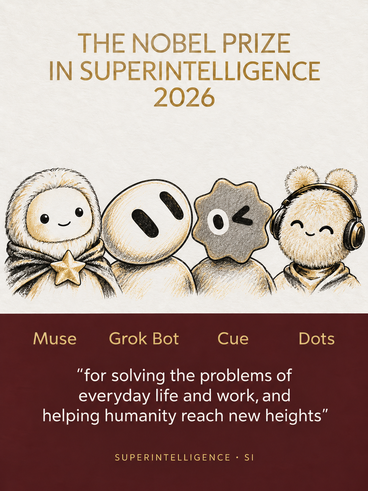

<div align="center">

# Nobel Poster Generator

**Turn portraits and product icons into custom Nobel-style announcement posters.**

[English](README.md) · [简体中文](README.zh-CN.md)

`Codex Skill` · `Photo → Portrait` · `Logo → Character`

</div>

---

## Give everyday brilliance an award

Turn a portrait, a team, or an AI assistant into a custom Nobel-style announcement poster. The skill studies an actual reference image before generating: head size, pose, cropping, spacing, and typography all matter.

**Your photo defines the identity. The reference defines the composition.**

<p align="center">
  
</p>

<p align="center"><em>A fictional 2026 Superintelligence (SI) award, adapted to four characters.</em></p>

## What it does

| Input | Result |
| :--- | :--- |
| Full-body photo, half-body photo, or headshot | A recognizable portrait adapted to the reference’s head size, pose, and crop |
| Multiple people | Coordinated portraits with explicit name-to-position mapping |
| Product logo, app icon, or mascot | An illustrated character that retains the original silhouette and facial details |
| Custom names, award, year, and citation | Text fitted to the reference’s hierarchy and layout |

Choose a historical year, or let the skill verify the latest year with all six award categories published. Custom awards and expanded lineups are supported as composition adaptations.

## Install

Clone this repository into your Codex skills directory:

```sh
git clone https://github.com/wangbh030722/nobel-poster-generator.git \
  ~/.codex/skills/nobel-poster-generator
```

If you use a custom `CODEX_HOME`, install under its `skills` directory. If the destination already exists, back it up or use another location. Private repositories require GitHub access.

**Requirements:** Codex with an available image-generation tool, access to reference images, and clear subject photos or recognizable icons. This is an instruction skill, not a standalone app or bundled image model.

## Try it

Attach a photo and send:

```text
Use $nobel-poster-generator to create a Nobel-style announcement poster.
Name: Alex Chen
Award: Nobel Prize in Everyday Ingenuity
Year: 2026
Citation: for turning everyday problems into surprisingly elegant solutions
```

For a lineup of AI assistants:

```text
Use $nobel-poster-generator to create a four-character poster.
Left to right: Muse, Grok Bot, Cue, Dots.
Award: Nobel Prize in Superintelligence
Year: 2026
Citation: for solving the problems of everyday life and work,
and helping humanity reach new heights
Use verified logos or app icons as character references.
Preserve their recognizable shapes and expressions when adapting them.
```

You can write prompts and poster text in Chinese or English. Supply exact names and citation wording; the skill asks for missing details instead of inventing them. For closer matching, specify a reference year and award, or attach the exact poster you want to use.

## From reference to poster

1. **Find and inspect** the reference, recording its source and template year.
2. **Map the layout** using normalized portrait and text regions.
3. **Adapt the subject** while retaining facial identity or icon features.
4. **Generate and review** the image, with up to two targeted revision rounds.

The example above was generated with the built-in image tool. Grok Bot’s tilted capsule eyes and Cue’s rounded silhouette and wink were corrected against their actual icons; their bodies are custom additions. The layout was adapted from a third-party reproduction of a 2025 announcement, rather than verified as an exact official template.

## Quality & attribution

- Aim for close visual alignment, not a promise of pixel-perfect reproduction. The approximately 3% layout tolerance in the review guide is a target, not a model guarantee.
- Text and recognizable identity require visual review. Difficult poses, small faces, and long citations may need clearer inputs or shorter wording.
- Generated posters are custom artwork, not official award announcements or endorsements. Original artist signatures and attribution are not reused as credits for new work.

## Inside the skill

| File | Purpose |
| :--- | :--- |
| [SKILL.md](SKILL.md) | Inputs, reference selection, generation, and delivery workflow |
| [Composition guide](references/composition-and-photo-adaptation.md) | Measurement, photo adaptation, and visual acceptance criteria |
| [agents/openai.yaml](agents/openai.yaml) | Codex display metadata and automatic discovery |

The operational instructions are currently written in Chinese; the usage examples and documentation are available in both languages.
